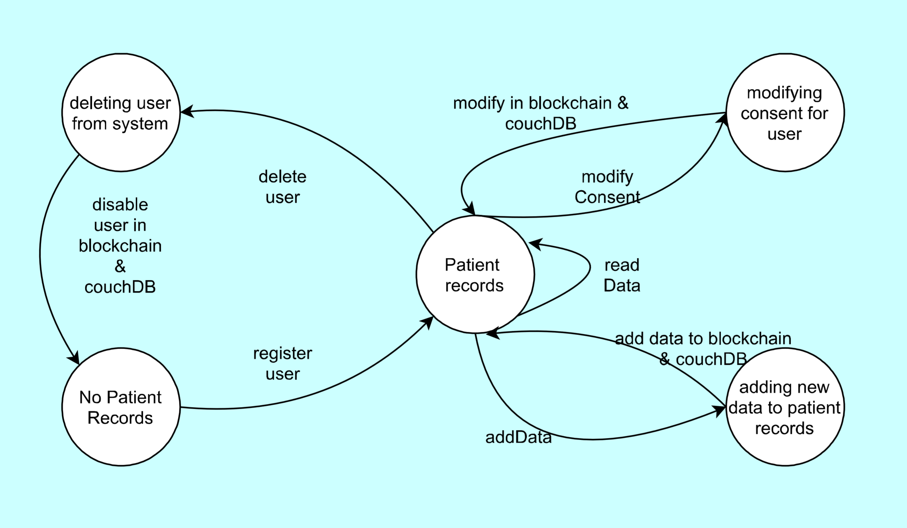

# DAPP1-Electronic-Health-Records

## Secure Management and Sharing of Electronic Health Records

### Students:

- Aditi Sharma
- Neeraj Bhasin
- Majid Shockoohi
- Malhar Dave
- Mariam Delos Reyes
- Taj Sivers

DAPP Using Blockchain and Hyperledger Fabric to track Electronic Health Records consent given by patient to different users.

This solution will use Hyperledger Fabric Blockchain to be as a gateway to provide information on consent given by patient to various section of health care system to access patient medical records.
Actual records are not being stored and only id of each record will be stored on-chain alongside information on who may or may not access this information.
Functionalities will be exposed through REST Api , therefore bringing potential of all kind of systems, apps and architecture to be build on top of the system.

## System overview V - 0.1.0

### States

| State                              | Description of state                                                      |
| ---------------------------------- | ------------------------------------------------------------------------- |
| No Patient Records                 | State where no user has been created hence no records exists.             |
| Patient records                    | After user registry or modification of data bew record will exists        |
| Modifying consent for user         | User will modify consent given for single record changing state           |
| Adding new data to patient records | New data on patient will be added to the record changing state to new one |
| Deleting user from system          | Deleting user will disable user in DB and disable modification on records |

### Transitions

#### Transition design

| Transition              | State From -> To                                      | Description |
| ----------------------- | ----------------------------------------------------- | ----------- |
| register user           | No Patient Records -> Patient Records                 | ..          |
| add data                | Patient records -> Adding new data to patient records | ..          |
| add data to BC & DB     | Adding new data to patient records -> Patient records | ..          |
| modify consent          | Patient records -> Modifying consent for user         | ..          |
| modify in BC & DB       | Modifying consent for user -> Patient Records         | ..          |
| delete user             | Patient records -> deleting user from system          | ..          |
| disable user in BC & DB | deleting user from system -> No Patient Records       | ..          |

#### Transition implementation - Psuedo-Code

| Transition              | Function code & params                            | Notes |
| ----------------------- | ------------------------------------------------- | ----- |
| register user           | addUser(patientName,patientId)                    | ..    |
| add data                | addMedRecord(patientId,medicalRecObj)             | ..    |
| add data to BC & DB     | await ctx.stub.putState(patientId, medicalRecObj) | ..    |
| modify consent          | modifyConsent(patientId,medicalRecordId,consetTo) | ..    |
| modify in BC & DB       | await ctx.stub.putState(patientId, modObj)        | ..    |
| delete user             | deleteUser(patientId)                             | ..    |
| disable user in BC & DB | await ctx.stub.putState(patientId, modObj)        | ..    |

### Functions

| Function  | .... | Description |
| --------- | ---- | ----------- |
| read data | ...  | ..          |

### Roles
